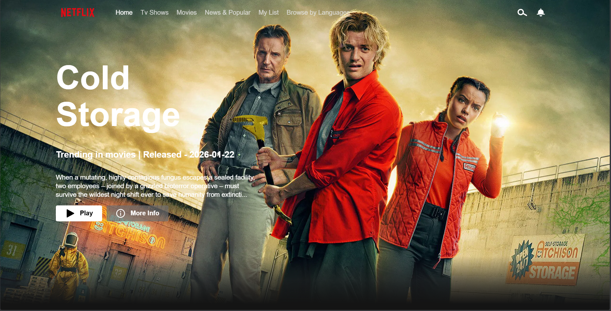

# Netflix Clone 🍿

A modern, fully-responsive Netflix frontend clone built with pure HTML, CSS, and Vanilla JavaScript. It fetches real-time trending movies, categories, and trailers dynamically using the TMDB API.

## Features
- **Dynamic Content:** Fetches live movies and TV show data seamlessly from TMDB API.
- **Embedded Trailers:** Play YouTube trailers instantly inside customized movie tiles on hover.
- **Premium UI/UX:** Styled exactly like the authentic Netflix layout including custom fonts, infinite category scrolling, a massive main banner, and fade-in/fade-out load animations. 
- **Interactive UI:** Smooth zoom & pop-out micro-animations, background dimming, and custom dark-themed scrollbars.

## Technologies Used
- HTML5
- CSS3 (Animations, Keyframes, Flexbox)
- Vanilla JavaScript (Fetch API, Promises, DOM Manipulation)
- TMDB (The Movie Database) API

## Getting Started
1. Clone the repository: `git clone https://github.com/your-username/netflix-clone.git` (Don't forget to replace the URL with yours!)
2. Obtain an API key from TMDB.
3. Add your TMDB API key to `index.js`.
4. Open `index.html` in your browser to view the application. No dependencies or `npm install` needed!

## Preview

---

